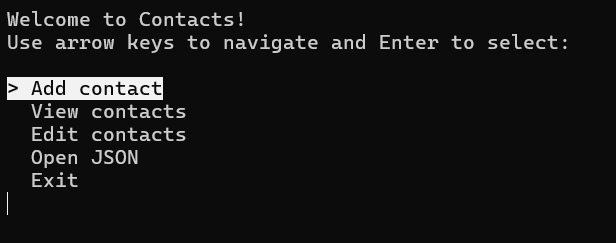
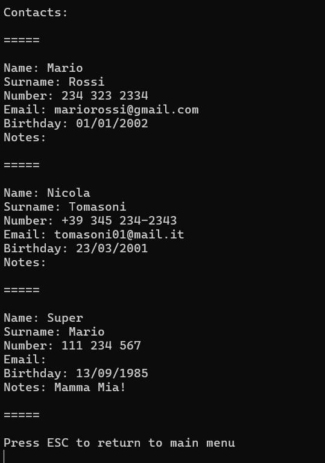
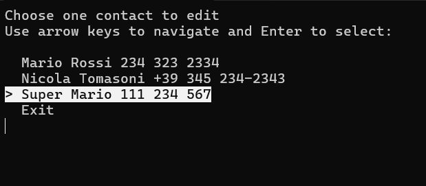
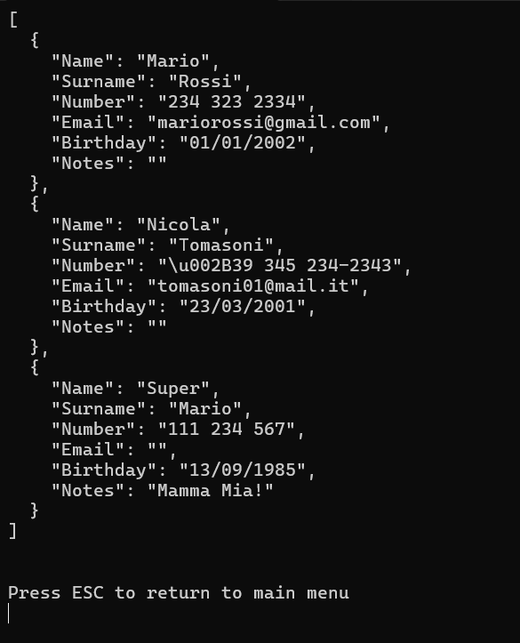

# Contacts App
A simple console-based Contacts application written in C#.  
It allows you to **add**, **view**, **edit**, and **export** your contacts in JSON format.

## Table of Contents
- [Features](#features)
- [How to Use](#how-to-use)
- [C# Concepts and Features](#c-concepts-and-features)
- [Requirements](#requirements)
- [Project Structure](#project-structure)
- [Notes](#notes)
- [Screenshots](#screenshots)

## Features
- **Add contact** with fields:  
  - Name (mandatory)  
  - Surname  
  - Phone number (mandatory, with validation)  
  - Email (optional, validated format)  
  - Birthday (optional, date format)  
  - Additional notes  

- **View all contacts** in a clean readable format.  
- **Edit existing contacts** by selecting the contact and the specific field to update.  
- **Export contacts** to a JSON file (`contacts.json`) and display its contents.  
- Contacts are **automatically sorted** alphabetically by name and surname.  
- Data persistence via JSON file storage.

## How to Use
1. Run the program.
2. Use the arrow keys to navigate the menu and press **Enter** to select.
3. Choose from:  
   - Add contact  
   - View contacts  
   - Edit contacts  
   - Open JSON (view raw JSON data)  
   - Exit  
4. When adding or editing contacts, input validation will prompt you for the correct data formats.

## C# Concepts and Features
- String manipulation  
- List<T> collection  
- Lambda expressions  
- LINQ methods
- Regex for input validation  
- Date parsing and formatting  
- JSON serialization and deserialization  
- File read/write operations  
- Exception handling
- Use of delegates
- Dynamic menu rendering  
- Custom sorting with comparator lambda
  
## Requirements
- .NET runtime (compatible with .NET 6 or later)
- Console environment for input/output

## Project Structure
- `Program.cs` — main application logic and menu system  
- `Contact` class — represents a contact's information  
- `contacts.json` — file used for storing contacts persistently  

## Notes
- Phone number must contain only digits and optionally `+`, spaces, or dashes.  
- Email addresses are checked for basic validity.  
- Birthday should be entered as `dd/mm/yyyy`.  
- Contacts without a name cannot be added.

## Screenshots

